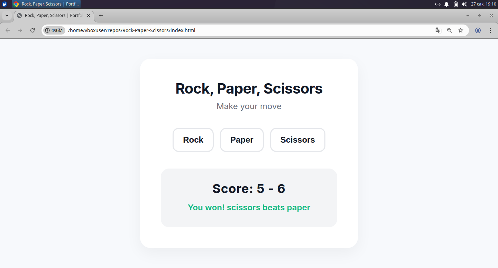

# Rock, Paper, Scissors Game

Simple rock-paper-scissors JS game. 


## Overview
A modern, interactive web implementation of the classic "Rock, Paper, Scissors" game. This project was built to demonstrate foundational frontend development skills, focusing on clean UI design, state management, and dynamic DOM manipulation using Vanilla JavaScript.

## Features
* **Dynamic UI Generation:** Game controls (buttons) and scoreboards are generated and injected into the DOM dynamically via JavaScript, keeping the HTML structure lightweight.
* **Real-time Score Tracking:** The game maintains and displays the ongoing score between the human player and the computer.
* **Color-Coded Feedback:** Round results provide immediate visual feedback using dynamic CSS styling (green for a win, red for a loss, gray for a draw).
* **Modern Styling:** Utilizes CSS Custom Properties (variables) for consistent theming, Flexbox for responsive layout, and smooth hover/active state transitions.
* **Clean Typography:** Integrates the 'Inter' font from Google Fonts for a highly readable, modern interface.

## Technologies Used
* **HTML5:** Semantic structure.
* **CSS3:** Flexbox, CSS Variables (Custom Properties), transitions, and responsive design principles.
* **Vanilla JavaScript (ES6+):** DOM manipulation, event listeners, arrow functions, and basic randomization logic.

## Technical Highlights
* **DOM Manipulation:** Instead of hardcoding the interactive elements in the HTML file, the project utilizes `document.createElement()` and `appendChild()` to build the interface programmatically.
* **Event Handling:** Uses `addEventListener` to capture user input and trigger game rounds efficiently.
* **Game Logic:** Implements a randomized computer choice generator using `Math.random()` and conditional logic to determine the winner of each round.

## How to Run Locally
Since this project uses entirely client-side technologies without external dependencies, running it is straightforward:

1. Clone the repository to your local machine:
   ```bash
   git clone [https://github.com/yourusername/rock-paper-scissors.git](https://github.com/yourusername/rock-paper-scissors.git)
